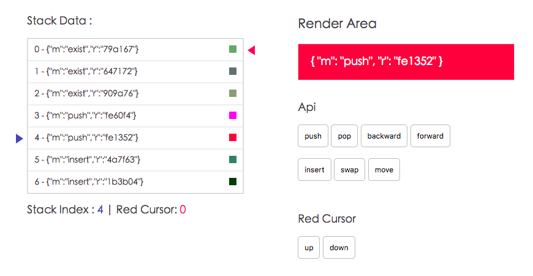

# Stack

> Stack is for ArrayLike Data Management, like history etc



## Install

```
$ npm install one-stack
```
## Quick start

```
import Stack from 'one-stack'

const stack = new Stack(10)

stack.push({some: 'data'})
```
## Class
### Stack(max)
- `max` number : stack max length, default 20

return object
- `index` number
- `max` number
- `data` array
```
const stackInstance = new Stack()
```
## API

### .push(any)
- `any` any type

```
stackInstance.push({some: 'data'})
```
### .pop()
```
stackInstance.pop()
```
### .forward()
set stack index forward
```
stackInstance.forward()
```

### .backward()
set stack index backward
```
stackInstance.backward()
```

### .insert(any)
- `any` any type

```
stackInstance.insert({some: 'data'})
```

### .swap(oldIdx, newIdx)
- `oldIdx` current target index
- `newIdx` target position index
```
stackInstance.push(3, 2)
```
### .move(oldIdx, newIdx)
- `oldIdx` current target index
- `newIdx` target position index
```
stackInstance.push(6, 3)
```

## Build Setup

generated by vue-cli simple template

``` bash
# install dependencies
npm install

# serve with hot reload at localhost:8080
npm run dev

# build for production with minification
npm run build
```

For detailed explanation on how things work, consult the [docs for vue-loader](http://vuejs.github.io/vue-loader).

## License

Copyright (c) 2018 One View Licensed under the MIT license.
